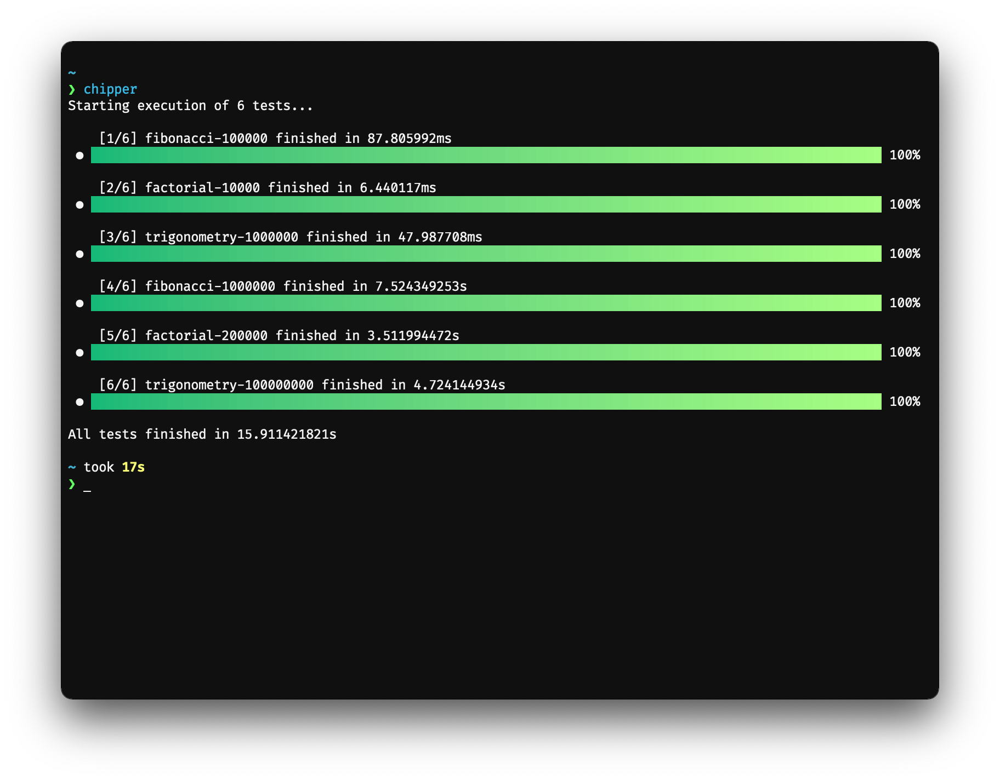

# 👾 Chipper

[](https://github.com/mymmrac/chipper/actions/workflows/ci.yaml)
[](https://goreportcard.com/report/github.com/mymmrac/chipper)

Chipper is a small tool for testing CPUs.

It runs multiple tests and measures execution time. Based on that time, you can relatively compare CPUs.

<p align="center">
  
</p>

> Note: Keep in mind that results may vary from run to run, and results don't show the real picture of which CPU is
> better. Speed of terminal, RAM, or even already running processes may dramatically affect results.

## 📋 Available tests

- Fibonacci sequence (`1, 1, 2, 3, 5`)
- Factorial (`1, 2, 6, 24, 120`)
- Trigonometry (`atan(tan(atan(... + e)))`)

## ⚡️ Install & Run

Install using `go install`

```shell
go install github.com/mymmrac/chipper@latest
```

> Note: Make sure to add `$GOPATH/bin` to `$PATH`

Run

```shell
chipper
```

Or run in `simple-mode` without pretty TUI (maybe slightly faster)

```shell
chipper -s
```
